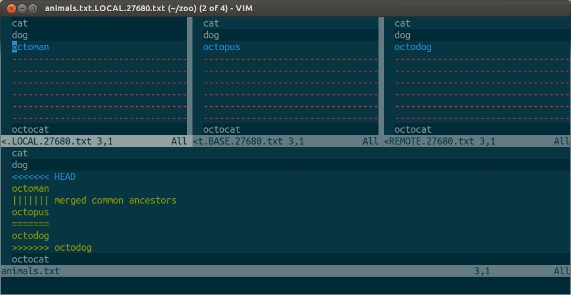

## Git 高级技巧


# 1. Git 的基本设置

```
$ git config --global user.name "Huayi Wei"
$ git config --global user.email "weihuayi@xtu.edu.cn"
$ git config --global core.editor vim
$ git config --global merge.tool vimdiff
$ git config --global merge.conflictstyle diff3
$ git config --global difftool.prompt false
```

上面的配置都会保存到用户家目录下的 `.gitconfig` 文件.


# 2. 共享版本开发流程

## 2.1 增加合作者

## 2.2 开发流程

1. 开始工作时
```
$ git pull # 把服务器最新的修改拉回本地，如果能自动合并，git 会自动合并，弹出 commit
           # 编辑器，输入注释; 如果不能自动合并，请先在本地解决冲突。
``` 
2. 修改后
```
$ git status # 检查修改状态
$ git add . # 添加修改
$ git commit # 添加修改注释
$ git pull # 再次检查服务器是否有更新
```
3. 推送到服务器仓库 
```
$ git push
```

## 2.3 合并冲突



```
:diffg RE  " get from REMOTE
:diffg BA  " get from BASE
:diffg LO  " get from LOCAL
```

可以加入一个 Hook, 在 Merge 成功后, 删除一些备份文件, 如

```
*.orig
*_REMOTE_*
*_BASE_*
*_LOCAL_*
```

http://www.rosipov.com/blog/use-vimdiff-as-git-mergetool/


# 3. Pull and Request 开发流程


# 4. Git Hooks

当 Git 中一些重要的动作(commit, push, merge 等) 发生时, Hooks 提供一种执行脚本的方法. 

共有两种 Hooks : 
1. 客户端 Hook
1. 服务器端 Hook


# 5. 统计仓库当前代码行数

```
$ git ls-files | xargs wc -l
```

Git hooks 就是一些可执行的脚本。在一些事件的前后（如 commit，push，和 receive）可以被 Git 调用执行完成一些任务。

这些脚本仅仅被开发者的想像力所限制。


1. 切换到master分支
git checkout master
2. 更新master代码
git pull --ff-only upstream master
3. 创建新的分支，并在新的分支上进行开发
git checkout -b "newbranch"
4. 开发完成后，将修改的文件加入到github
git add file
5. 提交修改的文件
git commit -m “注释”
6. 将正在开发的分支提交到远端代码库
git push origin newbranch
7. 在github上发起pull request
分支合并后在本地执行第2步


1. 从发生冲突的分支(如:modifypwd)切换到本地master分支
git checkout master
2. 从主版本pull最新代码
git pull --ff-only upstream master
3. 切换到发生冲突的分支
git checkout modifypwd
4. rebase，提示发生conflict的文件
git rebase master
5. 修改文件冲突的文件
vim file
6. 对比修改后的文件(可以忽略)
git diff file
7. 加入文件到索引
git add file
8. 继续rebase
git rebase --continue
9. 如何提示还有冲突的文件则跳转到第5步执行强制push当前分支
git push origin modifypwd -f


Pull request流程

git checkout -b fanwangwang-master master
git pull https://github.com/fanwangwang/fem.git master
git checkout master
git merge --no-ff fanwangwang-master
git push origin master

共享版本流程

http://www.worldhello.net/gotgithub/04-work-with-others/020-shared-repo.html

版本控制是一种记录一个或若干文件内容变化，以便将来查阅特定版本修订情况的系统

* 直接记录快照，而非差异比较
* 所有的操作都是本地执行
* Git保持完整性
* 以文件哈希值索引，而不是文件名
* Git 一般只添加数据


