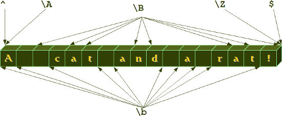

# 正则表达式

* globbing for shell  
* regualar expression 

两者是不同的东西

## 语法 

over matching
under matching

1. `.`: 任意的字符
1. `[]`, character class
    * [A-Za-z]
    * [-az] and [az-]: -, a, z
    * `^` caret, 脱字符
    * [^abc]
    * [a^bc]

## 预定义的字符类

* `\d`: 10 进制数字
* `\D`: 非 10 进制数字
* `\s`: 空格字符类 等价于 `[ \t\n\r\f\v]`
* `\S`: 空格字符类的补集 `[^ \t\n\r\f\v]`
* `\w`: 字母数字字符
* `\W`: 非字母数字的字符
* `\b`: 空字符串, 但是只是一个单词的开头和结尾
* `\B`: 非空字符串, 但是不在一个单词的开头和结尾
* `\\`: 反斜杠

## 单词的边界

`\b` 和 `\B` 匹配空字符串, 就是一个位置, 但要依赖空字符串前面和后面的字符种类

* `\b`: `\w` 和 `\W` 或者 `\W` 和 `\w` 之间的
* `\B`: `\W` 和 `\W` 或者 `\w` 和 `\w` 之间的
* `^`: 字符串的开头, `\A`
* `$`: 字符串的结尾, `\Z`



## Match begining and end

* `re.search(r, s)`: match `r` at any position in `s`
* `re.match(r, s)`: just match at the beginning of `s`
* `re.search(r"^M[ae][iy]er", s1)`: just match at the beginning of `s1`
* `re.search(r"^M[ae][iy]er", s, re.M)`: match at the beginning of `s` and
    after `\n` 
* `print(re.match(r"^M[ae][iy]er", s, re.M)`: just the beginning of `s`

```
>>> print(re.search(r"Python\.$","I like Python."))
<_sre.SRE_Match object at 0x7fc59c5f26b0>
>>> print(re.search(r"Python\.$","I like Python and Perl."))
None
>>> print(re.search(r"Python\.$","I like Python.\nSome prefer Java or Perl."))
None
>>> print(re.search(r"Python\.$","I like Python.\nSome prefer Java or Perl.", re.M))
<_sre.SRE_Match object at 0x7fc59c5f26b0>
>>> 
```

## Option items

* `r"M[ae][iy]e?r"`: e 是可选的
* `r"Feb(ruary)? 2011"`: ruary 是可选的

## 数量词 (quantifiers)

token 表征, 记号

一个数量词跟在一个记号后面,
记号可以是一个字母或括号里面的一组字母(subexpression group),
指定它们出现的次数.

* `?`: 
* `*`: 表示它前面的字母或括号里的表达式出现任意次, 如 `r"^[0-9][0-9]* "`
* `+`: 至少重复一次, 如 `r"^[0-9]+ "`
* `r"^[0-9]{4} [A-Za-z]*"`:
* `r"^[0-9]{4,5} [A-Z][a-z]{2,}"`:
* `{from, to}`:
* `{,to}`: `{0, to}`
* `{from, }`: 

## Grouping

* `( )`

## Capturing Groups and Back References

正则表达式中按顺序出现的 `( )`, 会被自动编号, 后面可以用 `\1`, `\2` 等来引用

## A Closer Look at the Match Objects

* `m.span()`
* `m.start`
* `m.group`

```
<composer>Wolfgang Amadeus Mozart</composer>
<author>Samuel Beckett</author>
<city>London</city>
```

```
composer: Wolfgang Amadeus Mozart
author: Samuel Beckett
city: London
```

```
import re
fh = open("tags.txt")
for i in fh:
     res = re.search(r"<([a-z]+)>(.*)</\1>",i)
          print(res.group(1) + ": " + res.group(2))
```

```
import re

l = ["555-8396 Neu, Allison", 
     "Burns, C. Montgomery", 
     "555-5299 Putz, Lionel",
     "555-7334 Simpson, Homer Jay"]

for i in l:
    res = re.search(r"([0-9-]*)\s*([A-Za-z]+),\s+(.*)", i)
    print(res.group(3) + " " + res.group(2) + " " + res.group(1))
```

## Named backreference

`?P<name>`

```
>>> import re
>>> s = "Sun Oct 14 13:47:03 CEST 2012"
>>> expr = r"\b(?P<hours>\d\d):(?P<minutes>\d\d):(?P<seconds>\d\d)\b"
>>> x = re.search(expr,s)
>>> x.group('hours')
'13'
>>> x.group('minutes')
'47'
>>> x.start('minutes')
14
>>> x.end('minutes')
16
>>> x.span('seconds')
(17, 19)
>>> 
```
